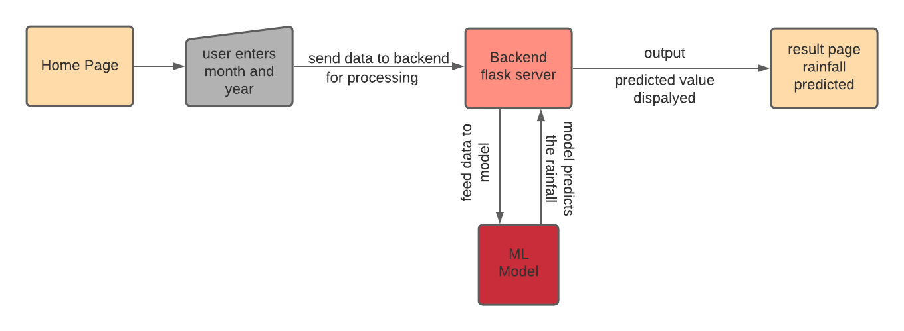

# Rainfall-Prediction-end-to-end-ML-project

The main motive of the project is to predict the amount of rainfall in Vidarbha region or state well in advance. We predict average rainfall using past data.



## Tech Stack

* Front-End: HTML, CSS
* Back-End: Flask
* IDE: Jupyter notebook, vscode

## How to Run the Project

1. **Clone the repository**

2. **Set up a virtual environment (optional but recommended):**
   ```
   python -m venv env
   source env/bin/activate  # On Windows, use `env\Scripts\activate`
   ```

3. **Install required dependencies:**
   ```
   pip install -r requirements.txt
   ```

4. **Train the model and create pickle file:**
   ```
   python app.py
   ```
   This will train the model using the provided dataset and save it as a pickle file.

5. **Run the Flask app:**
   ```
   python main.py
   ```
   The Flask app will start running, typically on `http://127.0.0.1:5000/`.

## CONCLUSION

XGBoost and Random Forest performed better compared to other models. However, if speed is an important thing to consider, we can stick with Random Forest instead of XGBoost.


## Improvements that can be done:

Here we can collect more data and use neurals networks
more computational power could be really useful for us.
